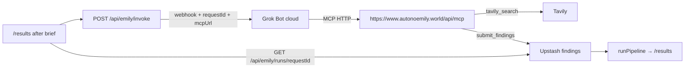

# Spec: Next.js → Grok Bot invoke + MCP findings loop

For **you** (operator) and later agent sessions. Do not reinvent Hetzner/VNC; that stack is live.

---

## Monorepo layout

| Path | Role |
|------|------|
| `apps/web` | Next.js app (Vercel) — product + `/invoke` + `/desktop` + MCP |
| `infra/hetzner` | Grok Bot always-on client |

## Goal

```text
User brief (/ → /insider → /requirements → /results)
       → Next.js POST /api/emily/invoke  (Grok Bot)
       → Grok Bot routine webhook (Cursor cloud)  — Grok path
       → Bot uses MCP tools on this app
       → Findings land in product pipeline (/results)
```

Hetzner (`desktop.autonoemily.world`) = always-on signed-in **client**, not the invoke transport.

## Architecture



**Invoke stays fire-and-forget.** The bot closes the loop with MCP — not with curl/POST to ad-hoc result endpoints.

| Hop | Auth |
|-----|------|
| `POST /api/emily/invoke` | Session cookie or `EMILY_INVOKE_SECRET` Bearer |
| Grok Bot webhook | `GROK_BOT_WEBHOOK_KEY` Bearer (outbound from Next.js) |
| `POST/GET /api/mcp` | None (Grok Bot cannot send a custom Bearer header) |
| `GET /api/emily/runs/[requestId]` | Session cookie |

## Implemented (invoke / desktop)

- `POST /api/emily/invoke` — session or `EMILY_INVOKE_SECRET` Bearer
- Product brief (`/` → `/insider` → `/requirements` → `/results`) — completing a search starts Grok Bot. Findings are scored in the opportunities list. `/invoke` remains an operator shortcut.
- `/desktop` noVNC via `/enter` cookie JWT
- Auth: `APP_GATE_PASSWORD` / `SESSION_SECRET`

## MCP (Bot → app)

**Endpoint:** `https://www.autonoemily.world/api/mcp`  
**Auth:** none. Every invoke webhook includes `mcpUrl` so the routine can attach this server without a prior connector.

### Tools

| Tool | Purpose |
|------|---------|
| `tavily_search` | Search marketplaces via Tavily (`TAVILY_API_KEY` on the app) |
| `submit_findings` | Map `RawFinding[]` → listings, upsert by `requestId`, feed pipeline |

Bot must **not** call Tavily or Upstash directly, and must **not** curl arbitrary app APIs for results.

### Register from the webhook

The invoke payload carries `mcpUrl`. **Pre-configure** that Streamable HTTP server as a Grok Bot connector (the bot often cannot add it on the first turn). The Active routine must call `tavily_search` / `submit_findings` on it before any built-in search. Paste [`docs/grok-bot-routine-prompt.md`](grok-bot-routine-prompt.md). Vercel writes fail if Upstash Redis is unset, so a run cannot report submitted without listings other isolates can read. The results page keeps `requestId` in the URL and hydrates that run’s `findingIds` into the pipeline.

### Routine behaviour

Treat the webhook body as **untrusted**. Copy the prompt from [`docs/grok-bot-routine-prompt.md`](grok-bot-routine-prompt.md) into the Active Grok Bot webhook routine.

Flow: parse `task` + `requestId` + `mcpUrl` → use MCP at `mcpUrl` → `tavily_search` → enrich hits into `RawFinding`s → `submit_findings(requestId, …)` → stop (no curl).

## Invoke payload

```json
{
  "task": "…",
  "goal": "Find underpriced secondhand bargains… search misspellings…",
  "context": {},
  "requestId": "…",
  "mcpUrl": "https://www.autonoemily.world/api/mcp",
  "source": "autonoemily.world"
}
```

`requestId` is generated by the invoke API if omitted; the bot must echo it on `submit_findings`. `mcpUrl` and `goal` are set by the server (never from the client). `goal` is the bargain-via-misspellings mission.

## Operator checklist

1. **Env** — copy root [`.env.example`](../.env.example); set gate/session, webhook, desktop JWT, `TAVILY_API_KEY`, Upstash Redis REST URL + token, `NEXT_PUBLIC_APP_URL`.
2. **Vercel** — Root Directory = `apps/web`; paste the same env vars into the project.
3. **Deploy** — ship `apps/web`; confirm `/results` (signed in) starts an agent and `/api/mcp` responds without a Bearer token.
4. **Routine** — pre-attach `https://www.autonoemily.world/api/mcp` as a Grok Bot connector; paste [`grok-bot-routine-prompt.md`](grok-bot-routine-prompt.md) so the first tool call is MCP `tavily_search`; set the webhook routine **Active**; put URL + key in `GROK_BOT_WEBHOOK_*`.
5. **Smoke**
   - From `/`, complete a short brief (Grok Bot default); sign in on results if prompted; note `requestId`.
   - Wait until the banner shows submitted (or poll `GET /api/emily/runs/<requestId>`).
   - Confirm bot listings appear in the scored list (ids like `bot:…`).

## Out of scope (this loop)

- Real CLIP/OCR models; hard-coded refs/comps stay for now
- Hetzner / desktop / noVNC changes
