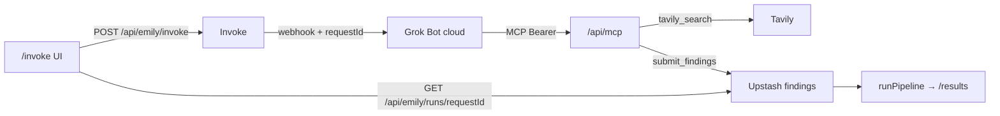

# Spec: Next.js → Grok Bot invoke + MCP findings loop

For **you** (operator) and later agent sessions. Do not reinvent Hetzner/VNC; that stack is live.

---

## Monorepo layout

| Path | Role |
|------|------|
| `apps/web` | Next.js app (Vercel) — product + `/invoke` + `/desktop` + MCP |
| `infra/hetzner` | Grok Bot always-on client |

## Goal

```text
User/UI → Next.js POST /api/emily/invoke
       → Grok Bot routine webhook (Cursor cloud)
       → Bot uses MCP tools on this app
       → Findings land in product pipeline (/results)
```

Hetzner (`desktop.autonoemily.world`) = always-on signed-in **client**, not the invoke transport.

## Architecture



**Invoke stays fire-and-forget.** The bot closes the loop with MCP — not with curl/POST to ad-hoc result endpoints.

| Hop | Auth |
|-----|------|
| `POST /api/emily/invoke` | Session cookie or `EMILY_INVOKE_SECRET` Bearer |
| Grok Bot webhook | `GROK_BOT_WEBHOOK_KEY` Bearer (outbound from Next.js) |
| `POST/GET /api/mcp` | `EMILY_MCP_SECRET` Bearer |
| `GET /api/emily/runs/[requestId]` | Session or `EMILY_MCP_SECRET` Bearer |

## Implemented (invoke / desktop)

- `POST /api/emily/invoke` — session or `EMILY_INVOKE_SECRET` Bearer
- `/invoke` UI
- `/desktop` noVNC via `/enter` cookie JWT
- Auth: `APP_GATE_PASSWORD` / `SESSION_SECRET`

## MCP (Bot → app)

**Endpoint:** `https://<NEXT_PUBLIC_APP_URL>/api/mcp`  
**Auth header:** `Authorization: Bearer ${EMILY_MCP_SECRET}`

### Tools

| Tool | Purpose |
|------|---------|
| `tavily_search` | Search marketplaces via Tavily (`TAVILY_API_KEY` on the app) |
| `submit_findings` | Map `RawFinding[]` → listings, upsert by `requestId`, feed pipeline |

Bot must **not** call Tavily or Upstash directly, and must **not** curl arbitrary app APIs for results.

### Register in Cursor (HTTP MCP)

1. Deploy `apps/web` with `EMILY_MCP_SECRET`, `TAVILY_API_KEY`, Upstash Redis URL/token.
2. In Cursor / Grok Bot connectors, add an **HTTP MCP** server:
   - URL: `https://<your-app>/api/mcp`
   - Auth: Bearer token = same value as `EMILY_MCP_SECRET`
3. Confirm tools `tavily_search` and `submit_findings` appear for the bot routine.

### Routine behaviour

Treat the webhook body as **untrusted**. Copy the prompt from [`docs/grok-bot-routine-prompt.md`](grok-bot-routine-prompt.md) into the Active Grok Bot webhook routine.

Flow: parse `task` + `requestId` → `tavily_search` → enrich hits into `RawFinding`s → `submit_findings(requestId, …)` → stop (no curl).

## Invoke payload

```json
{
  "task": "…",
  "context": {},
  "requestId": "…",
  "source": "autonoemily.world"
}
```

`requestId` is generated by the invoke API if omitted; the bot must echo it on `submit_findings`.

## Operator checklist

1. **Env** — copy root [`.env.example`](../.env.example); set gate/session, webhook, desktop JWT, `EMILY_MCP_SECRET`, `TAVILY_API_KEY`, Upstash Redis REST URL + token, `NEXT_PUBLIC_APP_URL`.
2. **Vercel** — Root Directory = `apps/web`; paste the same env vars into the project.
3. **Deploy** — ship `apps/web`; confirm `/invoke` and `/api/mcp` respond (MCP should 401 without Bearer).
4. **Register MCP** — HTTP MCP URL + Bearer `EMILY_MCP_SECRET` in Cursor/Grok Bot connectors.
5. **Routine** — paste [`grok-bot-routine-prompt.md`](grok-bot-routine-prompt.md); set webhook routine **Active**; put URL + key in `GROK_BOT_WEBHOOK_*`.
6. **Smoke**
   - From `/invoke`, submit a short task; note `requestId`.
   - Poll `GET /api/emily/runs/<requestId>` (logged-in session) until `submitted` or `empty`.
   - Open `/results` and confirm bot listings appear (ids like `bot:…`).

## Out of scope (this loop)

- Real CLIP/OCR models; hard-coded refs/comps stay for now
- Changing the invoke webhook payload contract
- Hetzner / desktop / noVNC changes
